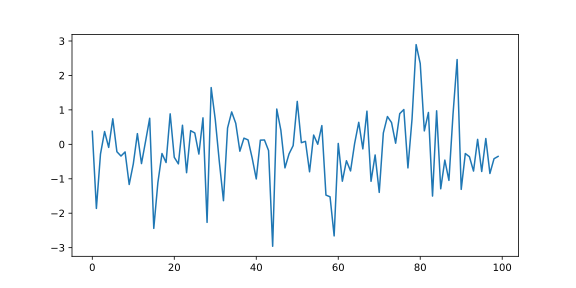
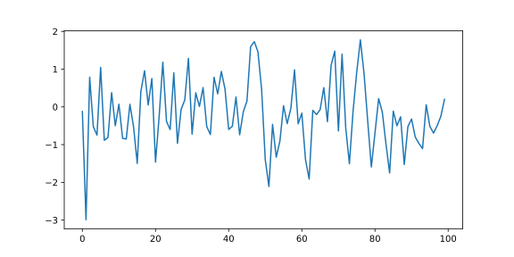
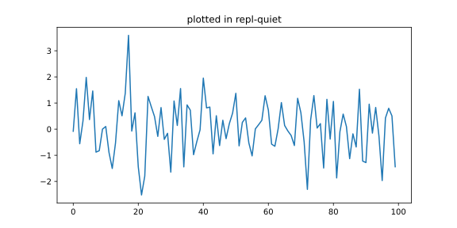

==========================================================================
sphinxcontrib-repl - Directives to auto-evaluate Python code-blocks
==========================================================================

|pypi| |pypi-status| |pypi-pyvers| |github-license| |github-status|

.. |pypi| image:: https://img.shields.io/pypi/v/sphinxcontrib-repl
  :alt: PyPI
.. |pypi-status| image:: https://img.shields.io/pypi/status/sphinxcontrib-repl
  :alt: PyPI - Status
.. |pypi-pyvers| image:: https://img.shields.io/pypi/pyversions/sphinxcontrib-repl
  :alt: PyPI - Python Version
.. |github-license| image:: https://img.shields.io/github/license/sphinx-contrib/repl
  :alt: GitHub License
.. |github-status| image:: https://img.shields.io/github/workflow/status/sphinx-contrib/repl/Run%20Tests
  :alt: GitHub Workflow Status

``sphinxcontrib-repl`` is an extension to `Sphinx <https://www.sphinx-doc.org/>`_ 
document generator tool. The extension introduces ``repl`` and ``repl-quiet`` 
directives to run Python REPL interpreters during Sphinx builds the 
documentation. The content of the directives will be automatically evaluated 
line-by-line in the interpreter, and ``repl`` blocks will add what would be 
printed on the interpreter to the output document. 

--------
Contents
--------

- `Installation <Installation_>`_
- `Basic Usage <Basic Usage_>`_
- `Matplotlib Integration <Matplotlib Integration_>`_
- `Options <Options_>`_

------------
Installation
------------

Install from PyPI:

.. code-block::
   
   pip install sphinxcontrib-repl

Then, inside your Sphinx ``conf.py``, add ``sphinxcontrib.repl`` to your list of extensions:

.. code-block:: Python

   extensions = [
       "sphinxcontrib.repl",
       # other extensions...
   ]

-----------
Basic Usage
-----------

To run Python code in the interpreter, list the code in a ``repl`` block:

.. code-block:: rst

   .. repl::
   
      2*3+4
      x=5
      f"{x=}"

First of such block will invoke a dedicated Python interpreter process, which will continue
to run in the background for each RST document until the document is fully parsed. The above block
of code will produce the following document block:

.. code-block:: python

   >>> 2*3+4
   10
   >>> x=5
   >>> f"{x=}"
   'x=5'

As the interpreter process will run continuously, the variables will carry between blocks. 
For example, after the above ``repl`` block, the variable ``x`` may be used in any 
subsequent ``repl`` blocks (unless you delete it):

.. code-block:: rst

   .. repl::
   
      x+4

will produce:

.. code-block:: python

   >>> x+4
   9

A REPL block may contain (potentially nested) condition/loop statements:

.. code-block:: rst

   .. repl::

      for i in range(5):
          if i>2:
              i+1

outputs

.. code-block:: python

   >>> for i in range(5):
   ...     if i>2:
   ...         i+1
   ...
   4
   5

Note that a trailing empty line to terminate the indented block will be inserted
automatically.

To hide nuisance operations (e.g., importing common libraries), 
use ``repl-quiet`` block:

.. code-block:: rst

   .. repl-quiet::

      import numpy as np

After this block, the Numpy package is loaded onto the interpreter, but the import
line will not be printed in the document.

--------------------------
Matplotlib Integration
--------------------------

Plotting ``matplotlib`` figures in the REPL interpreter process yields the figures
to be automatically exported to the document:

.. code-block:: rst
   
   .. repl::
      
      import numpy as np
      from matplotlib import pyplot as plt

      plt.plot(np.random.randn(100))
      plt.figure()
      plt.plot(np.random.randn(100))
      plt.show()

The above RST ``repl`` block generates the following Python code snippet and the 
figure images:

.. code-block:: python

   >>> import numpy as np
   >>> from matplotlib import pyplot as plt
   >>> plt.plot(np.random.randn(100))
   [<matplotlib.lines.Line2D object at 0x0000025C046CCDF0>]
   >>> plt.figure()
   <Figure size 800x400 with 0 Axes>
   >>> plt.plot(np.random.randn(100))
   [<matplotlib.lines.Line2D object at 0x0000025C0471A7F0>]
   >>> plt.show()

To hide the Python code, use the ``repl-quiet`` directive, which will only display 
the figures:

.. code-block:: rst

   .. repl-quiet::
      
      plt.plot(np.random.randn(100))
      plt.title('plotted in repl-quiet')
      plt.show()

This code prints only the image:

--------------------------
Options
--------------------------

Visibility Control Options
^^^^^^^^^^^^^^^^^^^^^^^^^^

By default, ``repl`` directive shows everything and ``repl-quiet`` hides everything. It is possible
to control the visibility of input and output lines in the ``repl`` directive with the following
directive options and magic comments.

=================  =====================  ===========
Directive          Magic comment          Description
=================  =====================  ===========
``:hide-input:``   ``#repl:hide-input``   Hide input (directive option value: ``true`` or ``false``)
``:hide-output:``  ``#repl:hide-output``  Hide output (directive option value: ``true`` or ``false``)
\                  ``#repl:show-input``   Show input
\                  ``#repl:show-output``  Show output 
\                  ``#repl:hide``         Hide both input and output
\                  ``#repl:show``         Show both input and output
=================  =====================  ===========

For example,

.. code-block:: rst

   .. repl::
      :hide-output: true

      'only shown as input'

outputs

.. code-block:: rst

   >>> 'only shown as input'

and does not show the echoed output string.

To provide a fine-grain control, there are 6 magic comments to switch the visibility. They can be applied
only to a line (as an inline comment) or toggle for the remainder of the directive context.

.. code-block:: rst

   .. repl::

      #repl:hide-input
      'no input'
      'show input' #repl:show
      'no input again'
      #repl:show-input

      #repl:hide-output
      'no output'
      'show output' #repl:show
      'no output again'
      #repl:show-output

outputs

.. code-block:: rst

   'no input'
   >>> 'show input' 
   'show input'
   'no input again'
   >>> 
   >>> 'no output'
   >>> 'show output' 
   'show output'
   >>> 'no output again'

Matplotlib Options
^^^^^^^^^^^^^^^^^^

The Matplotlib figure properties can be customized by specifying the following options either as
the extension options (in the Sphinx ``conf.py`` file) or as the directive options. Be aware that the 
directive options persist in the subsequent directives.

In addition to the figure options, any Matplotlib rc settings could be changed via ``rc_params`` option.
Consult `the default matplotlibrc file <https://matplotlib.org/stable/tutorials/introductory/customizing.html#the-matplotlibrc-file>`_
for possible entries. The exposed options are of the ``savefig`` group, except for ``figsize`` which
sets ``figure.figsize`` option in the REPL interpreter.

========================  =====================  ============  ===========
Extension                 Directive              Default       Description
========================  =====================  ============  ===========
``repl_mpl_disable``                             ``False``     ``True`` to disable matplotlib support
``repl_mpl_dpi``                                 ``96``        raster dots per inch 
``repl_mpl_format``                              ``svg``       output image format (default is pdf for latex) ``{png, ps, pdf, svg}``
``repl_mpl_figsize``      ``:mpl_figsize:``      ``6.4, 4.8``  figure size in inches
``repl_mpl_facecolor``    ``:mpl_facecolor:``    ``white``     figure face color
``repl_mpl_edgecolor``    ``:mpl_edgecolor:``    ``white``     figure edge color 
``repl_mpl_bbox``         ``:mpl_bbox:``         ``standard``  bounding box ``{tight, standard}``
``repl_mpl_pad_inches``   ``:mpl_pad_inches:``   ``0.1``       padding to be used, when ``bbox`` is set to ``tight``
``repl_mpl_transparent``  ``:mpl_transparent:``  ``False``     whether figures are saved with a transparent
``repl_mpl_rc_params``    ``:mpl_rc_params:``                  other ``rcParams`` options
========================  =====================  ============  ===========

Example of extension options in ``conf.py``:

.. code-block:: python
      
   repl_mpl_disable = False
   repl_mpl_figsize = (8, 4)
   repl_mpl_dpi = 96
   repl_mpl_format = "svg"
   repl_mpl_facecolor = "gray"
   repl_mpl_edgecolor = "black"
   repl_mpl_bbox = "tight"
   repl_mpl_pad_inches = 0.1
   repl_mpl_transparent = False
   repl_mpl_rc_params = {"lines.marker": "o"}

Example of directive options:

.. code-block:: rst
      
   .. repl-quiet::
      :mpl_figsize: 6, 4
      :mpl_facecolor: orange
      :mpl_edgecolor: red
      :mpl_bbox: standard
      :mpl_pad_inches:  0.1
      :mpl_transparent:  False
      :mpl_rc_params:  {"lines.marker": "x", "lines.markersize": 3}
      
      plt.plot(np.random.randn(100))
      plt.title('plotted in repl-quiet')
      plt.show()

Image Options
^^^^^^^^^^^^^

All of the options of the ``image`` directive, except for ``target`` (since target 
image is generated by the REPL process). Currently, these options applies to the
Matplotlib figure images.

==================  ===========
Directive           Description
==================  ===========
``:image_alt:``     Alternate text: a short description of the image
``:image_height:``  The desired height of the image
``:image_width:``   The width of the image
``:image_scale:``   The uniform scaling factor of the image
``:image_align:``   The alignment of the image
``:image_class:``   Set a "classes" attribute value on the doctree element generated by the directive
==================  ===========
